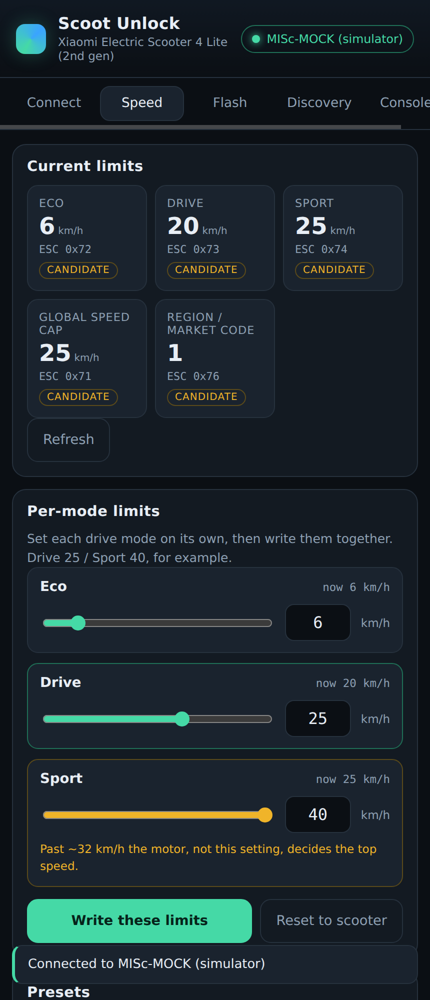
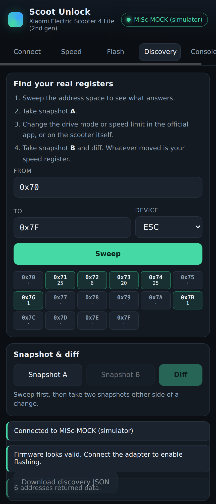

# Scoot Unlock

A browser app for reading and changing the speed limits on a Xiaomi Electric
Scooter 4 Lite (2nd gen), over Bluetooth, with no install and no account.

<p align="center">
  
  
</p>

## Running it

It is a static site with no build step and no dependencies.

```bash
python3 -m http.server 8000
# then open http://localhost:8000
```

Or push it anywhere static (GitHub Pages works). Web Bluetooth requires HTTPS or
localhost.

**Browser:** Chrome or Edge on Android, Windows, macOS, Linux or ChromeOS. iOS
Safari does not implement Web Bluetooth — use Bluefy. Installs as a PWA and works
offline.

**No scooter to hand?** Press **Use simulator**. It runs a simulated controller
that speaks the real protocol, so every part of the app works end to end.

## Two ways in, depending on your scooter

**If your 4 Lite is a 2024 Brightway model (most are), the speed limit is in the
MCU firmware** — it is not a writable register, and it cannot be changed over
Bluetooth because the radio chip signature-checks firmware. The real unlock is a
**wired firmware flash**, which this app now does from the browser over Web
Serial (see the **Flash** tab and [docs/FLASHING.md](docs/FLASHING.md)). You
supply the patched `.bin` (patched on [bw-patcher](https://github.com/scooterteam/bw-patcher));
the app flashes it over a ~$3 USB-to-TTL adapter.

**The BLE register tools below** (Speed / Discovery / Console) are for the older
M365/Pro-era scooters that expose the limit as a live register, and as a
diagnostics companion. On a Brightway 4 Lite they will not move the limit — use
the Flash tab.

## Setting the limits (register-based scooters)

Each drive mode has its own register, so they are set independently — Drive 25
with Sport 40 is two boxes on the **Speed** tab, not a preset someone had to
think of in advance. Sliders and number boxes stay in sync, values are clamped
to the ceiling, and anything past the warning threshold is flagged in the row.
All the edited modes are then written in one confirmed batch.

Presets (Stock, Derestricted 30, Motor limit 32, Uncapped 40) are shortcuts for
the common cases and write through exactly the same verified path.

## The state of things

The parts that do not depend on the model are done and tested: framing,
transport, the session/crypto layer, register read/write with verification,
change logging and revert, discovery, and the UI.

Two model-specific pieces are deliberately **not** guessed:

1. **The register map.** The built-in speed-limit addresses are inherited from
   the older M365 generation and are marked `candidate`. They have not been
   confirmed on a 4 Lite 2nd gen, and the app refuses to write to them unless you
   turn on Expert mode. The Discovery tab derives the real addresses from your
   scooter in a few minutes.
2. **The BLE handshake.** 2024+ models negotiate an AES session key before
   accepting frames. The AES implementation and handshake interpreter are done;
   the constants have to be captured once from your own scooter.

Both are covered step by step in **[docs/NEEDED-INFO.md](docs/NEEDED-INFO.md)** —
that is the file to read next, and the data it describes is what turns this from
"works on the simulator" into "works on your scooter".

The reason for not shipping guessed addresses: a write to the wrong register does
not fail loudly. It silently modifies whatever else lives there. Deriving the
address takes five minutes and removes the guesswork entirely.

## How it works

```
UI (src/ui/app.js)
  └─ Tuner ......... speed profiles, safety gates      src/core/tuning.js
  └─ Discovery ..... sweep, snapshot, diff, promote    src/core/discovery.js
  └─ Scooter ....... request queue, verified writes    src/core/scooter.js
       └─ Session .. plaintext or AES, profile-driven  src/proto/session.js
       └─ Frames ... M365 + Ninebot codecs             src/proto/frame.js
       └─ Transport. Web Bluetooth, or the simulator   src/ble/transport.js
```

Device differences live in `profiles/*.json`, not in code. Adding a model — or
completing this one — is a JSON change.

See [docs/PROTOCOL.md](docs/PROTOCOL.md) for the wire formats.

## Flashing (Brightway 4 Lite)

The **Flash** tab runs the Brightway MCU DFU protocol over Web Serial — a
faithful, tested port of [ScooterTeam's bw-flasher](https://github.com/scooterteam/bw-flasher).
It loads a patched `.bin`, validates it as a Brightway image, authenticates to
the bootloader (challenge/response, verified byte-for-byte against the original),
and streams the image in CRC-checked chunks with a progress log. It is a **wired**
flash — USB-to-TTL adapter, not Bluetooth, because modified firmware can't pass
the BLE signature check. Full walkthrough in [docs/FLASHING.md](docs/FLASHING.md).

## Safety

Speed limits above stock are for private land in most jurisdictions, and the
4 Lite's brakes and tyres are specified around its 25 km/h stock limit. The app
refuses anything above 40 km/h, warns above 32, verifies every write by reading
it back, and keeps a change log that Revert can replay backwards.

Worth knowing: the limit register is a cap, not a target. The ~300 W motor runs
out of pull around 30–32 km/h on the flat, so a setting above that removes the
restriction rather than adding speed.

[docs/SAFETY.md](docs/SAFETY.md) has the detail, including what to do if a write
misbehaves.

## Tests

```bash
node tests/aes.test.js          # FIPS-197 vectors for the bundled AES
node tests/integration.test.js  # read -> gate -> apply -> verify -> revert -> discover
node tests/flash.test.js        # CRC16/CRC32 + auth vs. the ScooterTeam reference
node tests/flash-e2e.test.js    # full DFU flash through a simulated bootloader
node tests/ui.smoke.mjs         # drives the real UI in headless Chromium
```

No test runner and no dependencies — they are plain Node scripts.

## Privacy

No network calls, no telemetry, no accounts. Confirmed register addresses are
stored in your browser's local storage and nowhere else.


## Credits

Firmware patching, the DFU flashing protocol, and the Brightway reverse
engineering are the work of others; this app ports their flashing protocol to the
browser and does not replace their tools:

- [ScooterTeam](https://github.com/scooterteam) — bw-patcher and bw-flasher (CC BY-NC-SA 4.0)
- [RoboCoffee](https://robocoffee.de/) — Brightway security analysis

Use bw-patcher to produce the patched firmware; use this app's Flash tab (or
bw-flasher) to write it.
